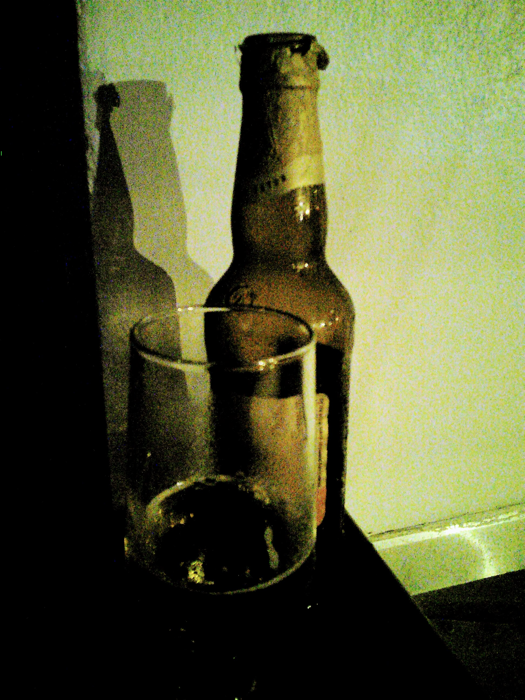

# Carnaval

While showing Vivace to Gera I explained to him that we could create any kind
of language to manipulate media. Gera understood the idea imediatelly and
sketched a language to manipulate videos. He called it *Carnaval*.

The idea remained abandoned for years, and now I'm trying to get back to it
before we have 2017's Carnaval in Brazil.

Ah, yeah, specific detail: Carnaval should be coded only while drunk or with
some influence of alcohol.

# Language Spec

TODO: Find it!

# Changelog

2017.01.14:

- Popcorn.js seems abandonware and YouTube doesn't accepts iFrame being
  manipulated by JS. However YouTube provides its iFrame API, so I started
  sketching the idea using it. Would be nice to support native HTML5 Media
  Elements in a near future, then we could play MP4/OGV/WEBM files (respecting
  CORS, maybe better to host everything) and process them with stuff like
  Seriously.js

  
